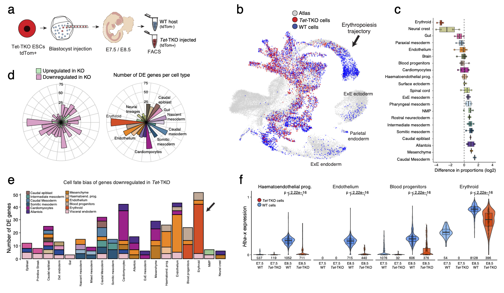

# Single-cell multi-omics profiling links dynamic DNA methylation to cell fate decisions during early mammalian organogenesis

This repository contains the scripts to reproduce the Tet-TKO scRNA-seq analysis of [the manuscript](XXX). It covers most of Figures 1-2 as well as Supplementary Figures 1-4.
The source code for the Tet-TKO scNMT-seq, is available in [this repository](https://github.com/rargelaguet/scnmt_gastrulation_TetChimera)

 

Experimental design
--------
We generated TET1/2/3 -/- (Tet-TKO) chimeric embryos following the study design of [Pijuan-Sala et al 2019](XXX), in which Tet-TKO cells are marked by the fluorescent marker tdTomato thereby allowing collection of two fractions using FACS: a fluorescent fraction that contains Tet-TKO cells and a non-fluorescent fraction that contains WT host cells (see diagram below).  In total, we profiled 24,355 Tet-TKO cells and 52,084 WT host cells at stages E7.5 and E8.5. As an additional control, we re-analysed a [published data set](https://www.sciencedirect.com/science/article/pii/S1534580720308893) where WT ESCs cells marked by tdTomato were processed and sequenced in a similar fashion as our experimental design (Guibentif et al. 2021). This allows us to control for potential technical biases in the contribution of injected ESCs to chimeric embryos. We assigned celltype labels by mapping the RNA expression profiles to a [comprehensive reference atlas that spans E6.5 to E8.5](https://www.nature.com/articles/s41586-019-0933-9)

Key results
--------

- We find a marked depletion of Erythroid and Neural crest cells in Tet-TKO cells at E8.5, together with an increase in mesodermal progenitor cells (Mixed mesoderm, Intermediate mesoderm) and ExE mesodermal tissue (Mesenchyme, Allantois, ExE mesoderm).

- Consistent with previous studies on Tet-TKO mutants, we observe diminished expression of Lefty2 in the nascent Mesoderm, which results in a [gain-of-function of Nodal signalling](Dai et al. 2016). This however does not lead to major defects in early mesodermal lineages.

- Late mesodermal cell types display the highest number of DE genes, including Cardiomyocytes, Endothelium and Erythroid cells.

- Most of the genes that are DE in Blood progenitors and Erythroid cells have a known role in blood differentiation, including *Hba-x*, *Klf1*, *Gata1*, *Gata2*, *Hemgn* and *Alas2*.

<!-- Content
-------
* `/met/`: analysis of DNA methylation data
* `/acc/`: analysis of chromatin accessibility data
* `/rna/`: analysis of RNA expression data
* `/metacc/`: simultaneous analysis of DNA methylation and chromatin accessibility data
* `/metrna/`: simultaneous analysis of DNA methylation and RNA expression data
* `/accrna/`: simultaneous analysis of chromatin accessibility and RNA expression data
* `/metaccrna/`: simultaneous analysis of all three omics (MOFA)
* `/H3K27ac/`: analysis of the H3K27ac levels in lineage-defining enhancers -->

Data
-------
The data is currently not publicly available, we are working on this...

<!-- The raw data is accessible at GEO ([GSEXXXX](XXXX)). 
The parsed data can be downloaded [here](XXXX) -->

Shiny app
--------
We provide a shiny app that allows the user to explore the Tet-TKO scRNA-seq results [here](https://www.bioinformatics.babraham.ac.uk/shiny/tet_ko_embryo_scrna/). Note that we currently do not have a shiny app to explore the scNMT-seq TET-TKO results.

Contact
-------

For questions on the computational analysis: Ricard Argelaguet (ricard.argelaguet@gmail.com). For questions on the experimental work: Tim Lohoff (tlohoff431@gmail.com) or Stephen Clark (Stephen.Clark@babraham.ac.uk)

